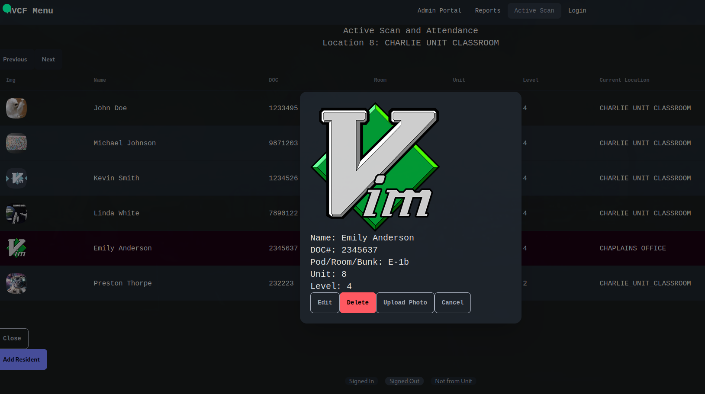
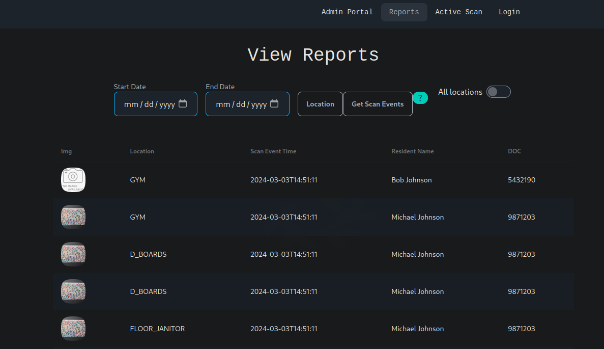

## RFID based attendance system built for MVCF. Point of sale, inventory and time clock system is in development.

__Rust: Actix-Web + SqlX/Sea-ORM__ - Backend

__Typescript: SolidJS/DaiseyUI__ - Frontend

Rust msrv: 1.76

This allows for the current locations of students to be monitored in real time across the facility, while providing a system of reports and analytics for administration. This requires RFID scanners with HID emulation to be used in the browser. An independent client for embedded RFID on an Raspberry Pi is in development.

Allows for data to be stored about students, the facility, accounts, attendance, and inventory items can be signed out to students. Time clock reports can be generated for payroll.

Certain parts are currently "hard-coded", but the `seed-data` directory can be altered to fit the needs of other facilities, the `locations` will have to be updated with the new locations of the facility, and the `` will have to be updated with the students that are attending the facility.

